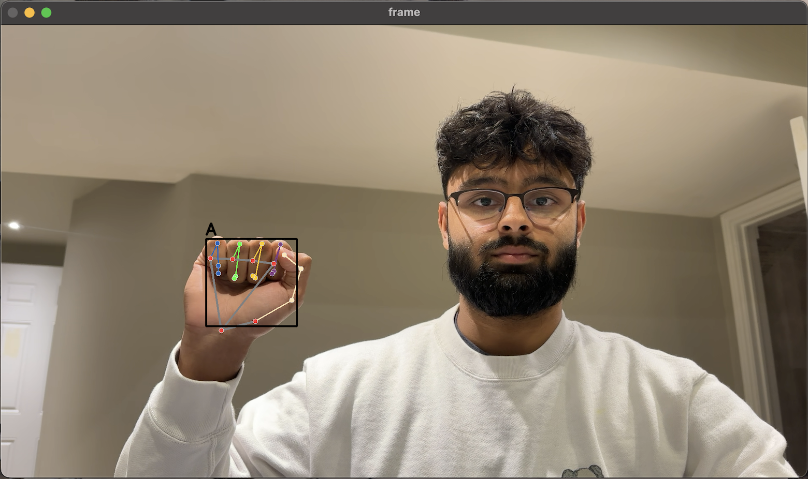

# SignLanguageAI

## Project Overview

SignLanguageAI is a computer vision project developed in Python that leverages various Python libraries to recognize and interpret American Sign Language (ASL) characters. This project makes use of a range of tools and technologies, including NumPy, Matplotlib, TensorFlow, Pickle, SciKit and OpenCV to achieve real-time sign language character recognition. Currently, it is trained to identify the ASL characters "A," "B," and "L."

## Features

- **Real-time Character Recognition:** SignLanguageAI uses computer vision to instantly recognize ASL characters "A," "B," and "L" when displayed to a camera.

- **High Accuracy:** The model has been fine-tuned to deliver high accuracy in character recognition, making it a reliable tool for ASL learners and enthusiasts.

- **Modular and Extendable:** The codebase is designed to be modular and easy to extend for adding more ASL characters, making it a great starting point for further ASL character recognition research and applications.

## Getting Started

To get started with SignLanguageAI, follow these steps:

1. **Clone the Repository:** Clone this repository to your local machine using the following command: `git clone https://github.com/zayedu/SignLanguageAI.git`

2. **Install Dependencies:** Make sure you have Python 3.11 installed and install the required Python libraries by running: `pip install -r requirements.txt`

3. **Run the Application:** Execute the main Python script to start recognizing ASL characters using your webcam: `python inference_classifier.py`

## Model Training

If you wish to train the model for additional ASL characters or enhance the accuracy of the existing ones, the dataset and training code are available in the `train_model` directory. Follow the provided instructions in that directory to train or fine-tune the model.

## Contributions

Contributions to SignLanguageAI are welcome! Whether you'd like to add new features, improve the model's accuracy, or expand the set of recognized ASL characters, please feel free to submit a pull request.

## License

This project is licensed under the MIT License - see the [LICENSE](LICENSE) file for details.

## Contact

- For inquiries, suggestions, or collaborations, please contact [your email address](mailto:umerz@mcmaster.ca).
